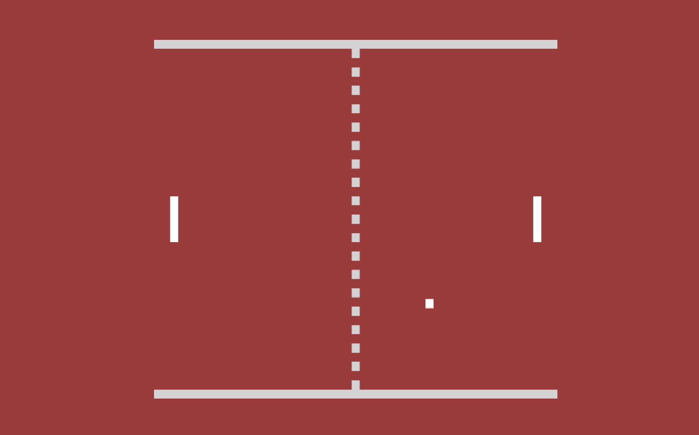

# Jogo Ping Pong

Jogo de ping pong para aprimorar as habilidades em front end.

## 🔨 Funcionalidades do projeto

Jogo interativo baseado na linguagem HTML.

## ✔️ Técnicas e tecnologias utilizadas

-`HTML`

## 🛠️ Abrir e rodar o projeto

Para abrir e rodar o projeto, utilize um editor de código de sua escolha.
Depois, abra o projeto no seu navegador.

## VERCEL 
https://ping-pong-two-tawny.vercel.app/
